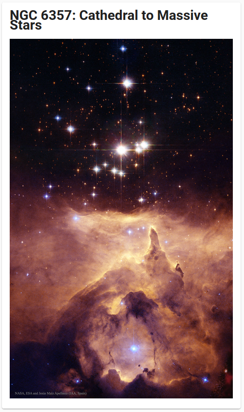

# APOD Component

This is a custom component for [Home Assistant](https://www.home-assistant.io/) that provides the Astronomy Picture Of the Day (APOD).

## Installation

To install the component, clone this repository and copy the `apod` directory to your custom components directory in your config.

`config_dir/custom_components/apod`

You will also need to register an account to get an API key. To generate a key, go to the [NASA Open API](https://api.nasa.gov/) page and register.

To register the integration in home assistant you will need to add it to your configuration as show below.


```yaml
sensor:
  - platform: apod
    api_key: !secret nasa_api_key
```

## Example Frontend

Here is an example of how to display the image to the lovelace UI using a markdown card. Currently there is no easy way to display the image url using Home Assistant Core. There are custom cards available that support this functionality.

```yaml
cards:
  - type: markdown
    content: |
      # {{states('sensor.apod')}}
      }})
```


